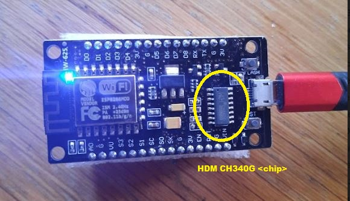
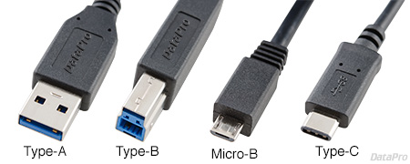
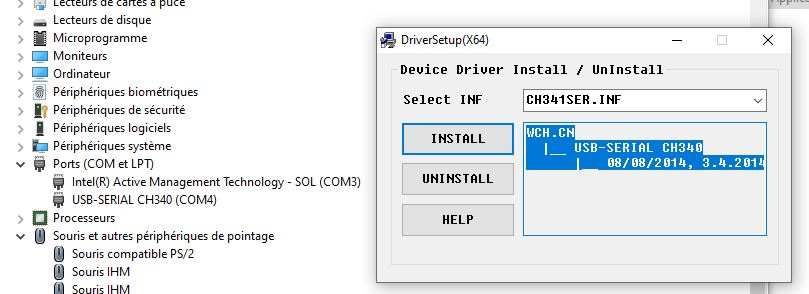

[< back](../readme.md)

## Introduction

Goal of this page is to understand how to setup hardware: 
- buy an ESP8266 CARD.
- connect the card to your workstation.
- update your workstation to let him understand how to exchange with the card.

## Steps to set up hardware

- your card chip : what's that ? cf. § `Card chip`
- Buy your card : cf. § `Card shopping`
- Connect your card : cf. § `Card connect`
- Install your driver : cf. § `Card driver`

## Card chip

The chip is the brain component of your board. It directs what you will or will not be able to do. This section help you to choose which chip to buy or detect which chip is on your card.

- Choose :

I've not a lots of details for now on this part. I know that 2 of mainly used chips for ESP8266 CARD are `CP2112` and `CH340`. It seems they are quite similar (TODO: to be confirmed).

- Compare :

You may find on Internet a way to compare each chip model features : here is a sample :   http://esp32.net/usb-uart/

- Detect : visual diff between `CP2112` and `CH340`

If you already have an ESP8266 CARD. Here is the diff between CP2112 and CH340 :
- the chip is the main electronic component between usb connector and WiFi chip 
- look on him with a magnifying glass and the name is written on the chip (ex. `HDM CH340G`):
- - CP2112 is a square chip, 
- - CH340 is smallest, long and rectangular.

## Card shopping

- Search on Internet the following keywords: `+ESP8266 "ESP-12E"`

- You could specify the chip "CH340" or "CP2102".

Here is some example:

- Ali 1.89€ TTC (+ 0.91€ shipping)  https://fr.aliexpress.com/item/32665100123.html?spm=a2g0o.order_list.order_list_main.41.248c5e5btYXVEF&gatewayAdapt=glo2fra

## Card connect

- Connect your cable to the card via (micro-B) USB
- Connect your cable to host windows workstation via (Type-A) USB
  
  

## Card driver

Installing driver corresponding to your card ship will help Windows host to understand how to exchange with your board : 
- Look at cf. `ESP8266 card drivers` to find the driver corresponding to your chip. As this kind of information is always moving other the time, you may have to search your model on Internet to find the latest up-to-date driver. 
- How to verify : check device manager COM port to see if your model is well recognized by windows
- - open device manager : <kbd>Windows</kbd> + <kbd>x</kbd> and choose `Device manager` (aka `Gestionnaire de périphériques` in french)
- scroll down to `Port COM`

  
On this image we could confirm that Windows understant that there is a CH340 chip connected via USB with a dedicated COM PORT (COM4)

## Annexes

### ESP8266 card drivers

CH34xx chip

- CH340 Drivers for Windows, Mac and Linux
  https://sparks.gogo.co.nz/ch340.html
  CH34x_Install_Windows_v3_4.zip

CP2112 chip (not yet tested by me)

- CP2112 [src](https://www.aranacorp.com/fr/programmer-un-nodemcu-esp8266-avec-lide-arduino/)  [driver](https://www.silabs.com/developers/usb-to-uart-bridge-vcp-drivers)

