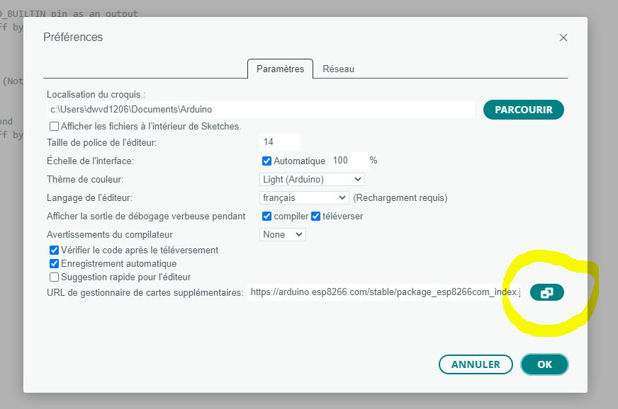
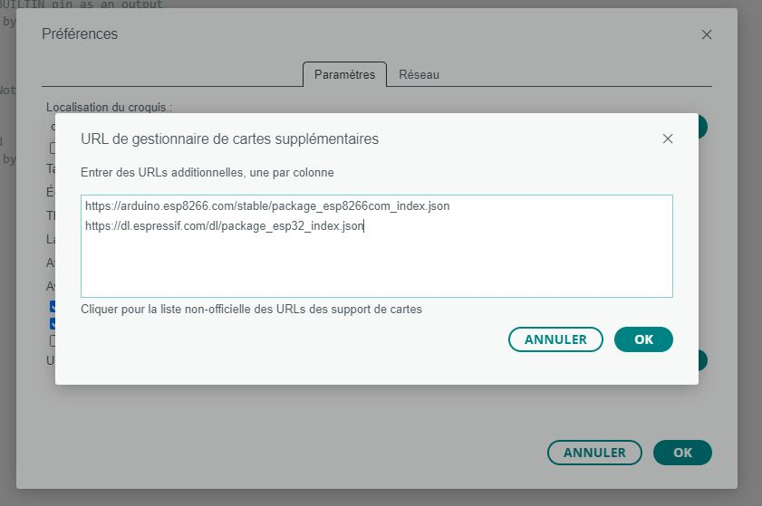
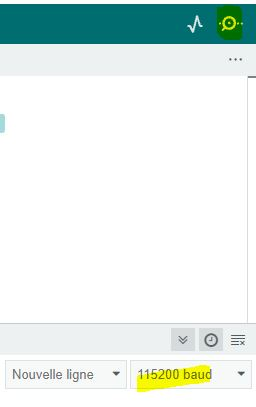
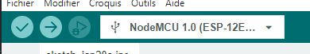
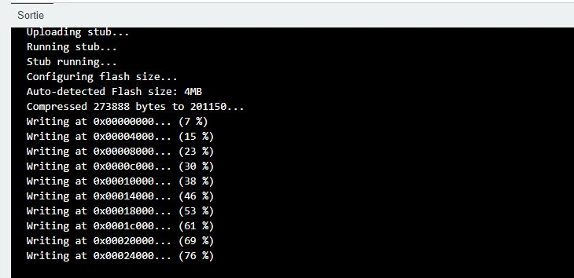
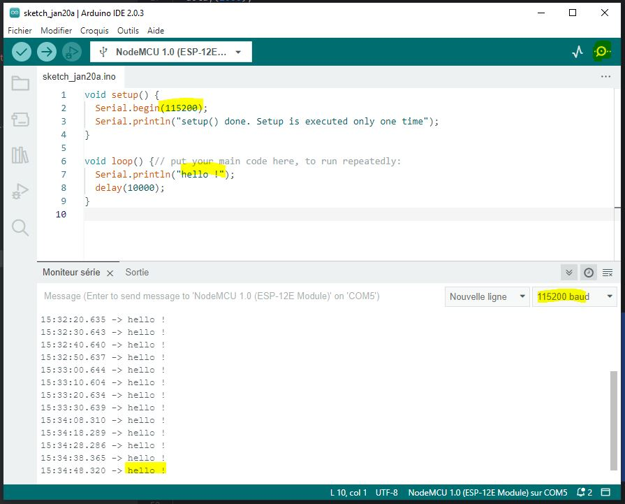
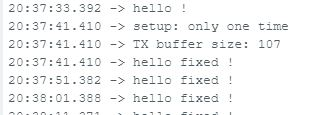

[< home](../readme.md)

[< previous: 0: set up hardware](./00_setupDriver.md) | 1: set up IDE | [next: 2: flash LED >](./20_flashLed.md)

## Introduction

Goal of this page is to understand how to set up software:
- retrieve an editor (IDE) that allow you to write code and send it to your card, we choose Arduino IDE.
- configure this editor for your card,
- run your first hello world ON your card!

## Arduino IDE setup

Steps to follow for the `Arduino IDE`:
- download Arduino
- configure Arduino : follow check list
- run your first hello-world sample

### Arduino IDE Download

- download IDE from https://www.arduino.cc/en/,
- setup on Windows like a classic application.

### Arduino IDE check list

**Step 1** card + driver ok : card is well known by windows

- Device must be USB connected and detected in Windows via good driver (cf. [previous step](./00_setupDriver.md))

**Step 2** IDE Library import

- IDE must import your device dedicated library via adding json definition in `| File > settings ` (aka `Fichier > Préférences` in french)



- with help of [arduino-esp8266.readthedocs.io](https://arduino-esp8266.readthedocs.io/en/latest/installing.html#boards-manager)
    - copy and install json

Example of added libraries :
- esp8266 par ESP8266 Community - version 3.1.0
>https://arduino.esp8266.com/stable/package_esp8266com_index.json
- esp32 par Espressif system - 1.0.5
>https://dl.espressif.com/dl/package_esp32_index.json




**Step 3** IDE card configuration

- Select you card : `Tool > card > esp8266`

Example of selected card: `esp8266 > NodeMCU 1.0 (ESP-12E Module)`

- Select COM Port on which your device is connected (double-check on Windows Device manager)

Example of selected port: `port > COM5`

- Select some default parameters in the `Tools` menu (aka `Outils` in french)

>Debug port > serial

>Debug level > Core

This parameters will provide some feedback to you via "Serial monitor" Arduino window. (TODO: to be confirmed).

You're now ready to test your first sample !

### Run you first sample

In this example you will just send a minimal code to your card that send "hello" to your serial (the arduino serial monitor help you to read it).

**Step 1** copy-paste this sample under your IDE:

The editor initial content include a `setup` and a `loop` function.
- `setup` function is called at startup, one time only.
- `loop` function is called after and repeated.

This is an [helloWorld.c](../sample/helloworld/helloWorld.c) example that:
- setup debug serial speed to `115200` baud.
- print a sentence with carriage return after setup : `setup: only one time`.
- print `hello !` with carriage return, wait `10000` milliseconds
- print `hello !` with carriage return, wait `10000` milliseconds
- print `hello !` with carriage return, wait `10000` milliseconds
- ...

```c
void setup() {
  Serial.begin(115200);
  Serial.println("setup: only one time");
}

void loop() {// put your main code here, to run repeatedly:
  Serial.println("hello !");
  delay(10000);
}
```

- open the serial monitor (aka `Moniteur série`) view (upper right button)



**Warn:** please pay attention that the `serial speed` (in baud) you have set in `Serial.begin(115200);` must match Arduino "Serial Monitor" windows speed. In case of mismatch you will see some strange output in the console ;)


**Step 2** compile and send it !

Let's play with upper left button to (1) compile and verify the code (2) send the code to your card.




**Step 3** monitor the serial output

Looking at the bottom of your IDE in the serial monitor : you must get `hello !` each 10 seconds.



### Next steps
- *for men in a hurry*: try to increase upload speed. 

- *for Bug killer*: if you pay attention, you will have noticed that the `setup()` method does not correctly print messages to serial. Have fun researching the `Serial` documentation  on Internet to find out why and how to fix it. the solution lies in [helloWorld_fixed.c](../sample/helloworld/helloWorld_fixed.c)



- *for advanced users*: you could get more details about ESP library and IDA configuration via [ref](./99_external_resources.md) [1] [arduino-esp8266.readthedocs.io](https://arduino-esp8266.readthedocs.io/en/latest/index.html)
