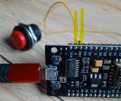

[< home](../readme.md)

[< previous: 2: flash LED](./20_flashLed.md) | 3: reset

## Introduction

Goal of this page is to understand how to reset your chip :
- reset: what's that ?
- yeah, we already have an on-board reset,
- create a remote reset button

## Reset: what's that ?

The reset feature is a way to reboot the ESP. 

On reset action, the board return to initial state in program mode and restart `setup()` then `loop()` functions.


### The on-board reset

Each ESP 8266 card embed a reset and a flash button. Here is an example (with  "CP2102" chip).


If you've a functional program from previous steps, let it running, then push on the "reset button" and check your serial output !

Here is an example:

```
13:43:54.391 -> Led on 3 x 200ms
13:43:55.269 -> now sleep 5000ms
13:43:58.720 -> sd$ܟ<�l�|�d�c<ǃ��{�c�c��gn�do'���cp��${ls$p�'��d��b'�|���c��gn�d��d`�god`'{���gc$�l8�g�s�ܜ���cg�|�c��gn�d`�ngl n;Ǜ�'c��`;��gc��`���p�l`��o�l
13:43:58.797 -> SDK:2.2.2-dev(38a443e)/Core:3.1.1=30101000/lwIP:STABLE-2_1_3_RELEASE/glue:1.2-65-g06164fb/BearSSL:b024386
13:43:59.297 -> setup() is done
13:43:59.342 -> Led on 3 x 200ms
13:44:00.210 -> now sleep 5000ms
13:44:05.233 -> Led on 3 x 200ms
```

We could verify here that the ESP just reboot, 
- at `13:43:58.720` : it seems that the serial output is not well understand : maybe there is not a good serial setup or baud rate at this boot very first time, never-mind : it's not really important, ignore this.
- at `13:43:59.297` : we could verify that the `setup()` function has just been called
- at `13:43:59.342` and `13:44:05.233`: we could verify that the `loop()` method is repeatedly called again.

### create a remote reset button

If you're novice in electronics like me, it may be hard to know what should be done in order to add a remote button that act like on-board reset button.

**How to understand on-board reset button**

Here is a quite simple way to understand how to understand the inboard button with a voltmeter which has diode test function.


- voltmeter: set it on diod function (cf. image above) : that's making a sound when red and blue cables are touching together.
- set the red cable on one side of your on-board reset button.
- set the blue cable on each pin of your board : you will find which pin(s) is connected to this side of the button.
- let's do the same for the other side of the button.

If you're done correctly, here is the result:
- one side of the button is connected to the `RST` pin,
- other side of the button is connected to all `G` pins.

So implementing the RESET action is simple: you may have to link `RST` to `G` and release this link.


**Add a remote reset button**

Follow this steps:
- add link from one side of your button to `G` pin,
- add link from the other side of your button to `RST` pin,
- that's all !

[//]: <> (TODO: add sample with electronic kit image )
I'm still waiting for my electronics kit. In the meantime, I can still make this assembly with a few welds.



[//]: <> (TODO: ### Next steps )
