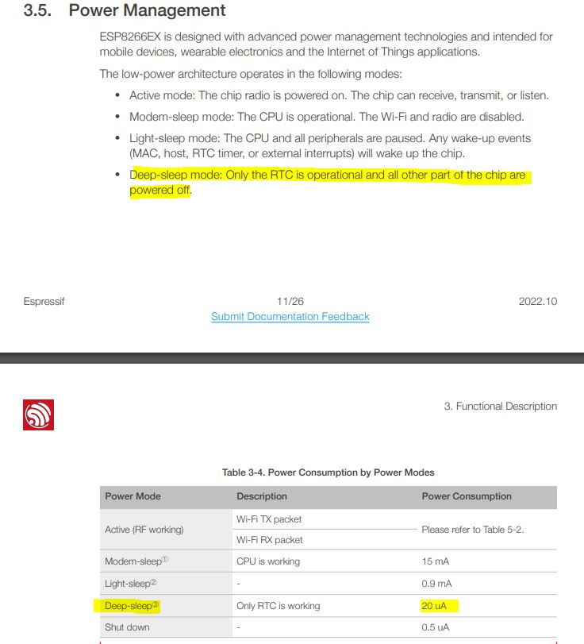

[< home](../readme.md)

[< previous: 3: reset](./30_reset.md) | 4: deep sleep

## Introduction

Goal of this page is to understand how to put your board in deep sleep :
- deep sleep: what's that ?
- activate deep sleep with code

[//]: <> (TODO: - on-board deep sleep )

## Deep sleep: what's that ?

While working with embedded devices that rely on a battery, power management is one of the very first question we have in mind. 

**Deep sleep** is one of the power management mode of the ESP8266 board. For example you could find some details in [Ref](./99_external_resources.md) [2] - [esp8266ex_datasheet_en](https://www.espressif.com/sites/default/files/documentation/0a-esp8266ex_datasheet_en.pdf).



The documentation says that in this mode, the board is sleeping for all components except internal counter ticking (aka. [RTC](https://nodemcu.readthedocs.io/en/release/modules/rtctime/)), and only RTC is able to wake up the board. Power consumption is `20µA`.

When we set the sleep mode, we could rely on some temporal unit (ex. [specific api notes](https://arduino-esp8266.readthedocs.io/en/latest/libraries.html#esp-specific-apis)) to wake up the board after `x` microseconds.

Else we could ask to sleep *indefinitely*. 

In both case reset (`RST`) action could wake up the board.


For a WiFi button, our need is really simple:
- on button push, wake-up the board to do some action,
- re-enter into low power sleep mode until button is pushed again.


So the **Deep sleep** mode is the best mode to fit our need. We will need understand how to activate this mode now.


[//]: <> (TODO: ### The on-board deep sleep )

### Activate deep sleep with code


We could also use `ESP.deepSleep(0)` to deep sleep indefinitely : in fact sleep just after a shutdown procedure.

[//]: <> (TODO: TODO NEED REF - where is ESP.deepSleep.. API details ? )

[//]: <> (TODO: experiment power down https://arduinodiy.wordpress.com/2021/01/15/very-deepsleep-and-energy-saving-on-esp8266-part-6-power-down-up/ )

There is also slight different `ESP.deepSleepInstant(0)` that deep sleep indefinitely **immediately** : without waiting for the WiFi to shut down.

For each of these deep sleep function, the RESET action is a way to wake up the board.

So we will implement some action in the `setup()` method, and then use `ESP.deepSleepInstant(0)`. That's all.

The board will ignore the rest (ex. code after `deepSleep` includeing `loop()` function) because the board is already sleeping.

On wake up, the board will start from scratch: starting from `setup()` method.

Here is an example that rely on `deepSleepInstant`.

```c
void setupSerial() {
  Serial.begin(115200);
  delay(500);// FIX : the ch340 is slow to start and need additional delay. src: https://forum.arduino.cc/t/serial-print-not-working-in-setup-but-works-in-a-loop/1020547
}

void setup() {
  setupSerial(); // setup Serial
  Serial.println("setup() just start");
  delay(500);
  Serial.println("my setup action here");
  Serial.println("my setup end");
  ESP.deepSleepInstant(0);// go to deep sleep without waiting for WiFi to shutdown
}

void loop() {
  Serial.println("loop()");
}
```

Now you could permut 2 lines to see :
```c
  Serial.println("my setup action here");
  ESP.deepSleepInstant(0);// go to deep sleep without waiting for WiFi to shutdown
  Serial.println("my setup end");
```

[//]: <> (TODO: ### Next steps )
