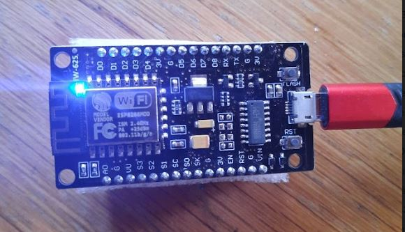

# WifiButton project

## Introduction

Goal of this project is to find how to use ESP8266 card to create a simple WiFi button.

- One constraint: help pages must be easy to understand for NooB and accept one simple introduction and a sample per step ^^.

## Steps to follow

- [setup ESP8266 card driver](./doc/00_setupDriver.md)
- [configure Arduino IDE for ESP8266](./doc/10_setupIDE.md)

[//]: <> (TODO: first code first flash)
[//]: <> (TODO: blink sample)

## Contribute

Contribution are welcome.

I am a beginner in electronics, a little less in development. However, errors or simplifications may occur at all levels. Don't hesitate to add your grain of salt. Be critical and constructive with tickets or pull requests.

As I'm not an expert at all, I rely on some Internet [sources](./doc/99_external_resources.md) and it's possible to encounter some error or `TODO` in some pages: you could provide more details to fix or complete them.